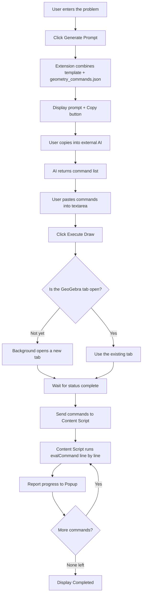
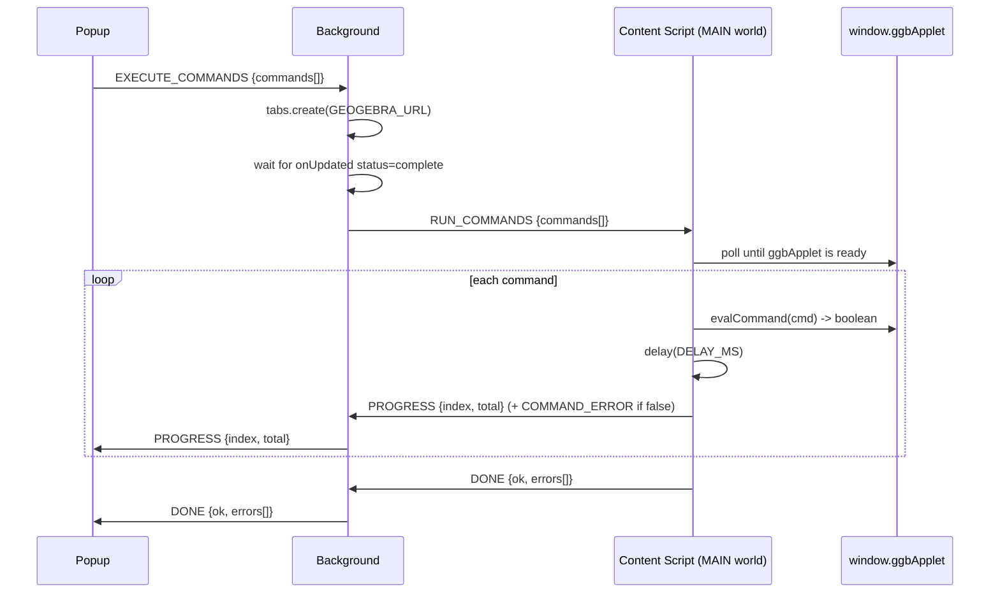

# GeoGebra AutoDraw AI — Specification & Guide

> **Status:** Draft v1.0 · **Methodology:** Spec-Driven Development (SDD) — code closely follows this document.
> **Audience:** Dev Team (Frontend Extension), QA.

---

## 1. Overview

### 1.1. Goal
GeoGebra AutoDraw AI is a Chrome Extension (Manifest V3) that helps teachers/students automatically draw plane geometry figures on GeoGebra. The extension acts as a **bridge between an external AI (Gemini/ChatGPT/Claude) and GeoGebra Calculator**:

1. The user enters a plane geometry problem.
2. The extension generates a **complete prompt** (problem statement + catalog of valid GeoGebra commands) for the user to copy into the AI.
3. The AI returns a list of **GeoGebra commands**.
4. The user pastes the command list into the extension and clicks "Execute".
5. The extension opens the tab `https://www.geogebra.org/calculator` and automatically runs each command via the GeoGebra Apps API (`ggbApplet.evalCommand`) → the figure is drawn automatically.

### 1.2. Scope
**In-scope:**
- Generate a prompt from a template + command catalog.
- Automate command entry into GeoGebra Calculator.
- Save the most recent problem / command history (local).
- Multi-language Popup UI (9 languages, English default — see §16).
- In-app usage guide via a Help button, fully localized (see §17).

**Out-of-scope — v1.0:**
- Calling the AI API directly (the user still copies/pastes manually into the AI).
- Exporting `.ggb` files, rendering images, OCR of a problem from an image.
- 3D solid geometry (only 2D plane geometry).

### 1.3. Target Users
Math teachers, students, tutors — no knowledge of GeoGebra syntax required.

---

## 2. Tech Stack

| Item | Choice | Notes |
|---|---|---|
| Build tool | **Vite** + `@crxjs/vite-plugin` | Hot-reload for the extension |
| Language | **TypeScript** (strict mode) | Required |
| UI Popup | **React 18** + **Tailwind CSS** | Manages multiple states |
| Package manager | **pnpm** | |
| Manifest | **V3** | Service Worker, no background page |
| Test | **Vitest** (unit) + manual E2E | TDD: test before code |

---

## 3. Architecture & Components

The extension consists of 3 components that communicate via Message Passing:

```
┌─────────────┐  message   ┌──────────────────────┐  inject + message  ┌──────────────────┐
│   Popup     │ ─────────► │  Background           │ ─────────────────► │  Content Script  │
│  (React UI) │ ◄───────── │  (Service Worker)     │ ◄───────────────── │  (GeoGebra tab)  │
└─────────────┘  status    └──────────────────────┘   progress/done    └──────────────────┘
       │                                                                          │
       │ chrome.storage.local                                       window.ggbApplet.evalCommand
       ▼
   [problem, commands, history]
```

### 3.1. UI (Side Panel) — `src/popup/`
> Rendered in Chrome's **side panel** (not a popup) so it stays open while the user interacts with the GeoGebra tab. Clicking the toolbar icon toggles the panel (`chrome.sidePanel.setPanelBehavior({ openPanelOnActionClick: true })`). The `src/popup/` folder name is kept for the React UI.
- Form to enter the **Problem**.
- **"Generate Prompt"** button → combines the template + `geometry_commands.json` → displays the prompt + a Copy button.
- Textarea to paste the **command list** returned by the AI. After pasting → auto-sanitize (§10.1); the result is displayed in an **editable** textarea so the user can edit/preview before drawing.
- Drawing mode choice (radio/toggle): **Clear and redraw** (default) | **Draw on top** → determines `clearFirst`.
- **"Execute (Draw)"** button → sends `EXECUTE_COMMANDS { commands, clearFirst }` to Background.
- Area displaying the **execution status** (running line x/n, errors, completed).

### 3.2. Background Service Worker — `src/background/`
- Listens for the `EXECUTE_COMMANDS` message from the Popup.
- Opens the GeoGebra tab: `chrome.tabs.create({ url: GEOGEBRA_URL })`.
- Waits for the tab `status === 'complete'` (via `chrome.tabs.onUpdated`), then sends `RUN_COMMANDS` down to the Content Script.
- Relays progress from the Content Script → Popup.

### 3.3. Page execution — `chrome.scripting` (no content scripts)
> **Updated architecture:** there are no content scripts. The Background runs the commands directly in the page's MAIN world via `chrome.scripting.executeScript({ tabId, world: 'MAIN', func })`, which sees `window.ggbApplet`. The Background drives the loop (waits for the applet, optional `reset()`, then one `executeScript` per command) and sends `PROGRESS`/`COMMAND_ERROR`/`DONE` straight to the side panel. This replaced the earlier two-layer content-script + `postMessage` bridge, which broke under the Vite 8 build (MAIN-world dynamic import resolved against the page origin).

---

## 4. Flow (Mermaid)

### 4.1. Overall flow (User journey)



### 4.2. Command execution flow (Content Script)



---

## 5. Message Passing Schema

Every message uses the structure `{ action: string, payload: object }`. The shared type definitions are in `src/shared/messages.ts`.

| Action | Direction | Payload | Description |
|---|---|---|---|
| `EXECUTE_COMMANDS` | Popup → Background | `{ commands: string[], clearFirst: boolean }` | Start drawing. `clearFirst` defaults to `true` (clear) |
| `RUN_COMMANDS` | Background → Content | `{ commands: string[], delayMs: number, clearFirst: boolean }` | Commands to run on the tab |
| `PROGRESS` | Content → Background → Popup | `{ index: number, total: number, command: string }` | Per-line progress |
| `COMMAND_ERROR` | Content → Background → Popup | `{ index: number, command: string, message: string }` | Single-line error (does not stop) |
| `DONE` | Content → Background → Popup | `{ ok: boolean, executed: number, errors: ErrorItem[] }` | Finished |
| `CONTENT_READY` | Content → Background | `{}` | Content script is ready |

```typescript
// src/shared/messages.ts
export type ErrorItem = { index: number; command: string; message: string };

export type Message =
  | { action: 'EXECUTE_COMMANDS'; payload: { commands: string[]; clearFirst: boolean } }
  | { action: 'RUN_COMMANDS'; payload: { commands: string[]; delayMs: number; clearFirst: boolean } }
  | { action: 'PROGRESS'; payload: { index: number; total: number; command: string } }
  | { action: 'COMMAND_ERROR'; payload: ErrorItem }
  | { action: 'DONE'; payload: { ok: boolean; executed: number; errors: ErrorItem[] } }
  | { action: 'CONTENT_READY'; payload: Record<string, never> };
```

---

## 6. Prompt Generation

### 6.1. Command data source
- The file `geometry_commands.json` (already present in the root directory) is copied to `public/geometry_commands.json` or imported as an asset.
- Structure: `[{ name, url, description, syntax[] }]`.

### 6.2. Optimizing prompt size
The full catalog is ~30KB → too long for a prompt. **Requirement:** generate a condensed version containing only `name` + 1 main `syntax` line + a short `description`, filtering for **2D plane geometry** commands (excluding unrelated 3D/statistics commands). Save it as `geometry_commands.min.json` at build time.

### 6.3. Prompt template
The template is stored in `src/shared/promptTemplate.ts`:

```
You are a GeoGebra expert. Draw the figure for the following plane-geometry
problem using a list of GeoGebra commands (one command per line, NO explanations,
NO numbering, NO markdown).

PROBLEM:
{{PROBLEM}}

CONSTRAINTS:
- Use the geometry commands from the allowed catalog below. In addition you MAY use these
  visibility commands to keep the figure clean: ShowLabel( <Object>, <true|false> ) and
  SetVisibleInView( <Object>, 1, <true|false> ).
- Command names MUST be in English (English command names), e.g. Polygon, Segment, Midpoint.
- Each line is one valid command runnable in the GeoGebra input bar.
- Name every object (A, B, C, a, h, H...) so it can be referenced afterwards.
- Return ONLY the command list, with no other text.

CLEAN FIGURE RULES (very important):
- Draw sides/edges with Segment, NOT with the infinite Line — unless the problem explicitly asks for a line or ray.
- Any helper object used only to locate a point (infinite lines, perpendiculars, parallels, bisectors,
  helper circles for intersection) MUST be hidden right after use: add SetVisibleInView( <name>, 1, false ).
- Hide the labels of every segment and line: add ShowLabel( <name>, false ). Keep labels ONLY on points.
- The final visible figure must show only the required points and segments — no construction clutter, no stray labels.

EXAMPLE — "draw triangle ABC and the altitude from A":
... (Segment for sides, ShowLabel(seg,false), SetVisibleInView(helperLine,1,false), then Segment AH)

ALLOWED COMMAND CATALOG:
{{COMMANDS_CATALOG}}
```

`{{PROBLEM}}` = the problem the user entered. `{{COMMANDS_CATALOG}}` = the condensed content from §6.2.

> **Clean-figure rationale:** GeoGebra shows infinite `Line` objects and auto-labels (a, b, c…) by default, which clutter the figure and visually hide the intended segments. The prompt therefore tells the AI to prefer `Segment`, hide construction helpers via `SetVisibleInView(obj, 1, false)`, and hide segment/line labels via `ShowLabel(obj, false)` — these two visibility commands are allowed in addition to the catalog.

---

## 7. Executing GeoGebra Commands (MAIN world via chrome.scripting)

> ✅ **DECIDED (spike 2026-06-05):** use the GeoGebra Apps API `ggbApplet.evalCommand`. This is the ONLY execution method — no keystroke simulation / DOM input-bar manipulation.
>
> **Delivery (updated):** the Background calls `chrome.scripting.executeScript({ tabId, world: 'MAIN', func, args })` to run each command in the page. Visibility commands (`ShowLabel` / `SetVisibleInView` / `SetVisible`) are routed to the JS API (`setLabelVisible` / `setVisible`) because the scripting commands load lazily and throw "Scripting commands not loaded yet" via `evalCommand`. No content scripts / `postMessage` bridge.

### 7.1. GeoGebra Apps API — `window.ggbApplet.evalCommand`
GeoGebra exposes the global object `window.ggbApplet` with the method `evalCommand(cmdString)`. This completely bypasses keystroke simulation / DOM selector probing.

- The content script polls until `window.ggbApplet` (or `window.ggbAppletOnLoad`) is ready.
- It calls `ggbApplet.evalCommand(command)` for each line.
- `evalCommand` returns a `boolean` → used as the `COMMAND_ERROR` signal if `false`.

```typescript
// Pseudo
if (clearFirst) window.ggbApplet.reset();   // Clear and redraw (default)
for (const [i, cmd] of commands.entries()) {
  const ok = window.ggbApplet.evalCommand(cmd);
  if (!ok) sendError(i, cmd, 'evalCommand returned false');
  sendProgress(i, commands.length, cmd);
  await delay(delayMs);
}
```

`clearFirst = false` → skip `reset()`, the commands draw on top of the existing figure ("Draw on top").

### 7.2. World Isolation — CONFIRMED ✅ (spike P3, 2026-06-05)
The content script runs in the ISOLATED world by default → it does NOT see `window.ggbApplet`. It is **required** to declare the content script with `"world": "MAIN"` in the manifest.

Spike [specs/spike-p3-world/](specs/spike-p3-world/) (load unpacked, content script `world:"MAIN"`): saw `ggbApplet` after 2 polls, `evalCommand('A=(0,0)')` → `true`, `reset()` available. → The MAIN world architecture works.

**Remaining secondary risk (confirmed in P3):** whether a `world:"MAIN"` content script can call `chrome.runtime.sendMessage` to talk to Background. If extension APIs are restricted in the MAIN world → a 2-layer architecture: ISOLATED content (handles message passing) + injected MAIN snippet (handles `evalCommand`), with the two layers communicating via `window.postMessage`.

### 7.3. Spike Record (2026-06-05)
- [specs/spike-7.1-ggbApplet.js](specs/spike-7.1-ggbApplet.js) — Console of the `/calculator` tab: `evalCommand` draws triangle ABC (4 commands → `true`).
- [specs/spike-p3-world/](specs/spike-p3-world/) — content script `world:"MAIN"`: saw `ggbApplet`, `evalCommand` + `reset()` run.

Available methods: `evalCommand`, `reset`, `newConstruction`, `deleteObject`, `getAllObjectNames`, `setCoordSystem`. `evalCommand` returns a `boolean` → per-command error signal. `reset()` → the "Clear figure" button.

---

## 8. Permissions (manifest.json)

```json
{
  "manifest_version": 3,
  "name": "GeoGebra AutoDraw AI",
  "version": "1.0.0",
  "action": { "default_icon": "icons/icon48.png" },
  "side_panel": { "default_path": "src/popup/index.html" },
  "background": { "service_worker": "src/background/service-worker.ts", "type": "module" },
  "permissions": ["tabs", "storage", "sidePanel", "scripting"],
  "host_permissions": ["https://www.geogebra.org/*"]
}
```

> No content scripts. Commands run in the page's MAIN world via `chrome.scripting.executeScript({ world: 'MAIN' })` (see §7). The side panel UI fetches `geometry_commands.min.json` directly as an extension asset, so no `web_accessible_resources` is needed.

| Permission | Reason |
|---|---|
| `tabs` | Find/track the GeoGebra Calculator tab |
| `storage` | Save problem/commands/history + UI language |
| `sidePanel` | Show the UI in Chrome's side panel |
| `scripting` | Run `ggbApplet.evalCommand` in the page's MAIN world |
| `host_permissions: geogebra.org` | Allow scripting + tab access on the GeoGebra domain |

---

## 9. Storage Schema (`chrome.storage.local`)

```typescript
type StorageSchema = {
  lastProblem: string;          // most recent problem
  lastCommandsRaw: string;      // most recent command textarea
  settings: {
    delayMs: number;            // default 600
    clearFirstDefault: boolean; // default true — remembers the user's drawing-mode choice
    locale: Locale;             // UI language (§16); default = detectLocale(), fallback 'en'
  };
  history: Array<{              // max 20 items
    id: string;                 // timestamp
    problem: string;
    commands: string[];
  }>;
};
```

Limit `history` to ≤ 20 items to avoid exceeding the quota. When exceeded → delete the oldest item (FIFO).

---

## 10. Edge Cases & Error Handling

| Situation | Handling |
|---|---|
| GeoGebra tab reloads mid-run | Content script sends `CONTENT_READY` again; Background stops the batch and tells the Popup "tab reloaded, run again". |
| `Extension context invalidated` | Wrap every `chrome.runtime.sendMessage` in try-catch; log + ignore. |
| `ggbApplet` not yet loaded | Poll up to 15s (interval 300ms); on timeout → `DONE {ok:false}` + report "GeoGebra not ready, try again". |
| Content script does not see `ggbApplet` | Wrong world. Ensure `world:"MAIN"` (§7.2). |
| Command with bad syntax | `evalCommand` false → `COMMAND_ERROR`, **continue** with the remaining commands (does not stop the whole batch). |
| AI returns markdown/numbering | Popup **sanitizes** before sending: strip ```` ``` ````, strip leading line numbers, trim, drop empty lines. |
| Storage exceeds quota | FIFO-delete old history; catch the `QUOTA_BYTES` error. |
| User clicks Execute when the textarea is empty | Disable the button + validate. |
| Multiple GeoGebra tabs open | Background stores `targetTabId`, operating only on the tab it created. |

### 10.1. Sanitize command input (Popup)
```
- Split on \n
- Strip ```geogebra / ``` fences
- Regex-strip leading prefixes "1. ", "- ", "* "
- trim() each line, drop empty lines
```

---

## 11. Directory Structure

```
geogebra/
├─ public/
│  └─ geometry_commands.min.json
├─ src/
│  ├─ popup/        # React UI (index.html, main.tsx, App.tsx, components/)
│  ├─ background/   # service worker
│  ├─ content/      # content script (world:MAIN, calls ggbApplet)
│  └─ shared/       # messages.ts, sanitize.ts, promptTemplate.ts
├─ specs/           # spike files (spike-7.1-ggbApplet.js, spike-p3-world/)
├─ tests/           # unit tests (Vitest)
├─ manifest.config.ts
├─ vite.config.ts
├─ tsconfig.json
└─ package.json
```

---

## 12. Acceptance Criteria

> Checked = implemented (Epics 2–4 done). Final manual E2E sign-off on real Chrome is still pending (Epic 5 — see [specs/e2e-checklist.md](specs/e2e-checklist.md)).

- [x] Enter the problem → click Generate Prompt → the prompt contains the problem + the command catalog, copyable in one tap.
- [x] The prompt asks the AI to return commands with English names.
- [x] Paste AI commands (even with markdown/numbering) → sanitize correctly into a clean command list, displayed in an editable textarea before drawing.
- [x] There is a "Clear and redraw" (default) / "Draw on top" choice; the mode is remembered next time.
- [x] Click Execute → the GeoGebra tab opens; if Clear, then `reset()` first, commands run sequentially, the figure is drawn.
- [x] Each line has a delay; commands run via `evalCommand`.
- [x] The Popup displays progress x/n and reports Completed.
- [x] A failed command does not stop the whole batch; it is listed in the results.
- [x] The most recent problem/commands are restored when the Popup is reopened.
- [x] No crash when the tab reloads / context is invalidated.

---

## 13. Resolved Decisions

1. **GeoGebra Apps API:** use `ggbApplet.evalCommand` — confirmed in the console (§7.3) + content script `world:"MAIN"` (§7.2). Remaining secondary risk: `chrome.runtime.sendMessage` in the MAIN world (confirmed in P3).
2. **Edit/preview commands:** YES. After sanitizing, commands are displayed in an editable textarea; the user edits before Execute (§3.1).
3. **Command language:** English. The prompt asks the AI to return commands with English names (§6.3).
4. **"Clear figure" button:** YES. On Execute, choose **Clear and redraw** (default) | **Draw on top**. Clear and redraw = `ggbApplet.reset()` before running commands (§3.1, §5, §7.1).

---

## 14. Dev Phasing

| Phase | Content |
|---|---|
| P0 ✅ | API spike (§7.3) — DONE 2026-06-05, feasible |
| P1 ✅ | Setup Vite+CRXJS+React+TS+Tailwind, manifest, message types — DONE |
| P2 ✅ | Popup UI + prompt generation + sanitize (with unit tests) — DONE |
| P3 ✅ | Background + Content Script (2-layer ISOLATED+MAIN, §7.2) + `evalCommand` execution — DONE |
| P4 ✅ | Edge cases, storage/history, "Clear figure" button (`reset()`) — DONE |
| P5 🚧 | UI polish + packaging — DONE; QA E2E on real Chrome — pending (manual) |
| P6 ✅ | Internationalization (i18n) — 9-language Popup UI (§16) — DONE |
| P7 ✅ | In-app usage guide + Help button, localized (§17) — DONE |

---

## 15. Dev Setup

```bash
pnpm install
pnpm dev          # build watch + HMR -> load unpacked dist/ into chrome://extensions
pnpm build        # production build
pnpm test         # run unit tests (Vitest)
pnpm typecheck    # type checking
```

Load the extension: `chrome://extensions` → enable Developer mode → **Load unpacked** → choose the `dist/` directory.

---

## 16. Internationalization (i18n)

The Popup UI supports 9 languages. The default is English; the chosen language is remembered across sessions.

### 16.1. Supported languages

| Code | Language | Native name |
|---|---|---|
| `en` | English (default) | English |
| `vi` | Vietnamese | Tiếng Việt |
| `zh-CN` | Chinese (Simplified) | 简体中文 |
| `es` | Spanish | Español |
| `pt` | Portuguese | Português |
| `fr` | French | Français |
| `de` | German | Deutsch |
| `ja` | Japanese | 日本語 |
| `ko` | Korean | 한국어 |

### 16.2. Design
- String catalogs live in `src/shared/i18n/` — one dictionary per locale, with `en` as the canonical key set.
- `t(locale, key, vars?)` looks up the locale dictionary, falls back to `en` for any missing key, then to the raw key. Supports simple variable interpolation (e.g. `{index}`, `{total}`).
- Initial locale: `detectLocale()` normalizes `chrome.i18n.getUILanguage()` (e.g. `en-US` → `en`, `zh` / `zh-CN` → `zh-CN`) and maps it to a supported locale; unknown → `en`. A saved `settings.locale` takes precedence.
- A language selector in the Popup updates the UI immediately and persists `settings.locale` (§9).

### 16.3. Invariant — command language stays English
The localization covers **UI strings only**. The generated prompt (§6.3) always keeps the constraint *"Command names MUST be in English"* and its examples (`Polygon`, `Segment`, `Midpoint`) regardless of the selected locale (§13.3). Only the surrounding instruction wording may be localized.

### 16.4. Acceptance criteria
- [x] Switching language updates all Popup strings immediately.
- [x] Default is English (or the detected browser language); the selected language is restored on reopen.
- [x] All 9 locales have the exact same key set as `en` (parity test).
- [x] No hardcoded UI strings remain in JSX (except the product name "GeoGebra AutoDraw AI").
- [x] Generated prompts keep English command names in every locale.

---

## 17. In-App Usage Guide (Help)

A **Help button** in the Popup opens an in-app usage guide so new users understand the workflow without leaving the extension. The guide is fully localized (reuses the i18n infrastructure of §16).

### 17.1. Behavior
- A Help button (`❓`) sits in the Popup header, next to the language selector.
- Clicking it opens a panel/modal with a Close button; closing returns to the main UI without blocking actions.

### 17.2. Content
- Step-by-step: (1) enter the problem → (2) Generate Prompt → (3) Copy → (4) paste into the external AI → (5) paste the returned command list → (6) pick the draw mode → (7) Execute.
- Tips: clean figure (prefer `Segment`, hide helper lines/labels, §6.3); command names must be English.
- Links: GeoGebra Calculator; note on first-time Developer-mode install (see [specs/manual-test-guide.md](specs/manual-test-guide.md)).

### 17.3. Localization
- All guide strings come from `t(locale, key)` (§16) — no hardcoded text.
- Guide keys are added to all 9 locale dictionaries (`en` canonical + 8 translations); the parity test (§16) covers them.

### 17.4. Acceptance criteria
- [x] Clicking Help opens the guide panel with clear step-by-step content.
- [x] Switching language updates the guide content immediately (all 9 locales).
- [x] The panel can be closed and does not block the main UI.
- [x] No hardcoded guide strings; parity test passes for the new keys.
